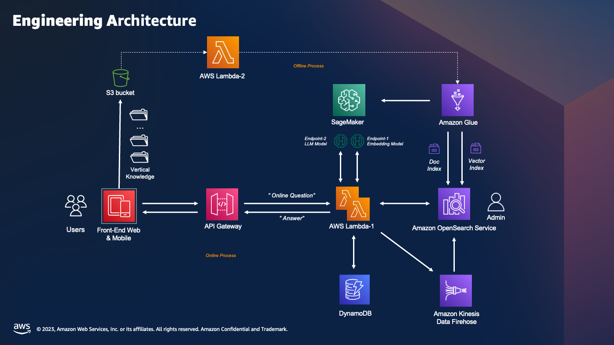

### QA-chatbot-workshop

- 代码介绍

```python
.
├── code
│   ├── main.py                          # lambda 部署主文件
│   ├── aos_write_job                    # aos 倒排和knn索引构建脚本 (glue 部署)
│   ├── chatbot_logs_func.py             # 对Cloudwatch输出的日志解析，通过KDF同步到OpenSearch (lambda 脚本)
│   ├── offline_trigger_lambda.py        # 调度 glue 的 lambda 脚本
│   ├── chatbot_logs_func.py             # 详细日志的解析处理，用于构建Kinesis Firehose中的日志处理的Lambda
│   ├── kendra_write_job.py              # kendra数据导入脚本 (glue 部署)
│   ├── QA_auto_generator.py             # 基于文档自动生成FAQ知识库 (离线前置处理)
│   └── build_and_push.sh                # 构建ECR Image 供部署后台主服务
├── deploy
│   ├── lib/                             # cdk 部署脚本目录
│   └── gen_env.sh                       # 自动生成部署变量的脚本(for workshop)
├── docs
│   ├── aws_cleanroom_faq.txt            # 知识库文件
│   ├── aws_msk_faq.txt                  # 知识库文件
│   └── aws_emr_faq.txt                  # 知识库文件
├── AWS_DOC_POC.ipynb                    # AWS文档-本地效果测试 notebook
├── document_segment.ipynb               # 文档切分调优 开发notebook
├── lanchain_demo.ipynb                  # lanchain 开发notebook
├── langchain+basic.ipynb                # lanchain 开发notebook
├── chatglm_deploy.ipynb                 # chatglm-6B LLM Model 部署notebook
├── bloomz_LLM_deploy.ipynb              # bloomz-7B LLM Model 部署notebook
├── llama_deepspeed_deploy.ipynb         # llama-7B LLM Model 部署notebook
├── paraphrase-multilingual-deploy.ipynb # Sentence2Embedding Model 部署notebook
├── text2vec_embedding_test.ipynb        # text2vec Model 部署notebook
├── Local_SentenceEmb.ipynb              # Studio 模型部署调试 notebook
└── SentenceEmbedding_deploy.ipynb       # GPT-6J Embedding Modeljumpstart部署 notebook
```

- 流程介绍

  - 离线流程
    - a1. 前端界面上传文档到S3
    - a2. S3触发Lambda开启Glue处理流程，进行内容的embedding，并入库到AOS中
    - b1. 把cloud watch中的日志通过KDF写入到AOS中，供维护迭代使用
  - 在线流程[网页](http://chatbot-alb-1653663846.us-east-1.elb.amazonaws.com:9988/)
    - a1. 前端界面发起聊天，调用AIGateway，通过Dynamodb获取session信息
    - a2. 通过lambda访问 Sagemaker Endpoint对用户输入进行向量化
    - a3. 通过AOS进行向量相似检索
    - a4. 通过AOS进行倒排检索，与向量检索结果融合，构建Prompt
    - a5. 调用LLM生成结果 
    - 前端[网页](http://chatbot-alb-1653663846.us-east-1.elb.amazonaws.com:9988/)切换模型

- 系统架构
  

- Script/Notebook 使用方法
  - QA_auto_generator.py 

    ```shell
    # step1: 设置openai key的环境变量
    export OPENAI_API_KEY={key}
    
    # step2: 执行
    python QA_auto_generator.py --input_file ./xx.pdf --output_file ./FAQ.txt \
        --product "Midea Dishwasher" --input_format "pdf" --output_format "json" \
        --lang zh
    ```
